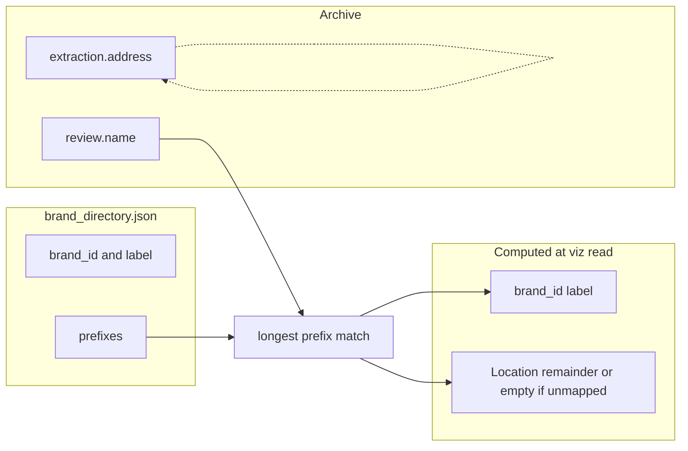

# Brand registry and derived Location (single plan)

## Prerequisites (done)

- **Phase 1** (`location` → `address`): complete. Receipt street address is field `**address`** on `ReceiptResult` and in [viz_data.py](viz_data.py) as column `**address`**. This plan never reintroduces `location` for street address.

## Vocabulary

| Concept            | Meaning                                                                                                                                                                                                                                                            |
| ------------------ | ------------------------------------------------------------------------------------------------------------------------------------------------------------------------------------------------------------------------------------------------------------------ |
| **Merchant name**  | Full string from `ReviewDecision.name`.                                                                                                                                                                                                                            |
| **Brand**          | Umbrella from registry: `brand_id`, `brand_label` (UI **Brand** or **Company name**).                                                                                                                                                                              |
| **Location** (viz) | Derived only. If a brand prefix matched: remainder after longest prefix. If **not** matched: **do not duplicate** merchant name in the UI—omit **Location**, show **—**, or hide the row (merchant line already shows the full string). Not persisted on sidecars. |
| **Address**        | Extraction `**address`** (street). UI label **Address** on receipt detail. Separate from **Location**.                                                                                                                                                             |

**Code naming:** Use something like `**brand_location`** for the derived remainder column so it never collides with `**address`**.

## Why post-processing

- [extraction.py](extraction.py) keeps a single `name` string; multilingual brand split in the LLM is fragile.
- No new persisted fields for brand/Location remainder. **Compute in** [viz_data.py](viz_data.py) `**load_viz_records` only**—add columns (`brand_id`, `brand_label`, `brand_location`, etc.) on the DataFrame for receipts; pages consume the dataframe, no per-page recomputation of brand split.
- Prefix list is user-edited; **longest-prefix wins**; **casefold** for Latin.

## Data model (Pydantic)

- **BrandEntry:** `id` (slug), `label` (display), `prefixes: list[str]` (non-empty).
- **BrandDirectory:** `brands: list[BrandEntry]`.
- Persist `**brand_directory.json`** next to [config.json](settings.py), with load/save helpers (dedicated module or alongside settings).

**Matching:** Longest matching prefix among all `(brand, prefix)` pairs; tie-break by first in file order.

**Derived Location (implementation):** If matched prefix `p`: `name[len(p):].strip()`. If `name == p` exactly, remainder empty. If no brand match: `brand_location` empty (UI does not duplicate **Merchant name**).

## Central resolution

- `resolve_brand(merchant_name, directory) -> ResolvedBrand` with `brand_id`, `label`, `matched_prefix` (optional), remainder.
- [viz_data.py](viz_data.py) `**load_viz_records`:** after building base rows, load registry, run `resolve_brand` per receipt row, append `brand_id`, `brand_label`, `brand_location`—**do not** overwrite `**address`**.
- **Cache:** Include `brand_directory.json` mtime in `load_viz_records` cache key so registry edits invalidate `@st.cache_data`.

## UI

1. **Brand registry** — New page in the same nav group as **Config** in [app.py](app.py) (today Config lives under the `""` key; add Brand registry there alongside it). CRUD brands and prefixes, save `brand_directory.json`.
2. **Merchant Profile** ([pages/visualize/merchant.py](pages/visualize/merchant.py)): Filter by brand; **Brand** vs **Location**; [merchant_url](viz_data.py) supports `?brand=<id>` and keeps `?name=` for raw drill-down.
3. **Dashboard** ([pages/visualize/dashboard.py](pages/visualize/dashboard.py)): Optional “group by brand” for top merchants; links use brand param when grouped.
4. **Receipt detail** ([pages/visualize/receipt.py](pages/visualize/receipt.py)): **Merchant name** always; **Brand** / **Location** only when useful (mapped brand and/or non-empty remainder); **Address** (street). When unmapped and no split, **Location** is not shown beside the same string as merchant name.

## Out of scope v1

- No new `ReceiptResult` fields for brand/Location remainder; no extraction prompt changes for this feature.
- No sync with [smart_match_cache](data.py) unless added later.

## Files likely touched

| Area             | Files                                                                                                                                                       |
| ---------------- | ----------------------------------------------------------------------------------------------------------------------------------------------------------- |
| Models + JSON    | New helper + `brand_directory.json`                                                                                                                         |
| Resolution + viz | [viz_data.py](viz_data.py)                                                                                                                                  |
| Nav              | [app.py](app.py)                                                                                                                                            |
| UI               | New brand registry page, [merchant.py](pages/visualize/merchant.py), [dashboard.py](pages/visualize/dashboard.py), [receipt.py](pages/visualize/receipt.py) |

## Risks

- Short prefixes cause false positives; prefer longer prefixes.
- Equal-length collisions across brands—document tie-break or validate on save.

