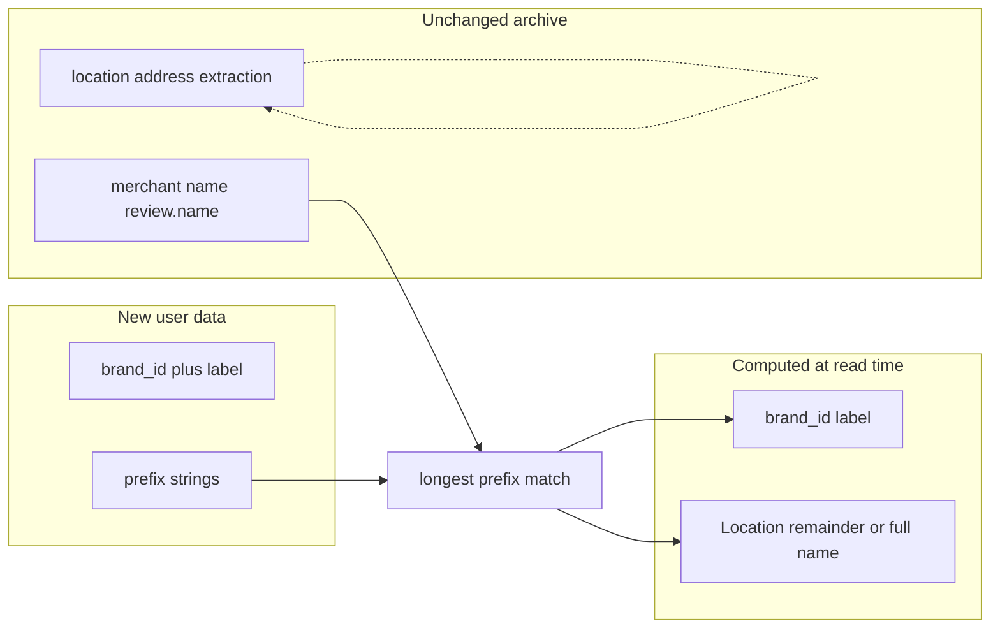

# Brand rollup via prefix registry (post-processing only)

## Vocabulary (locked in)

| Concept            | Meaning                                                                                                                                                                                                                                                                                                                                             |
| ------------------ | --------------------------------------------------------------------------------------------------------------------------------------------------------------------------------------------------------------------------------------------------------------------------------------------------------------------------------------------------- |
| **Merchant name**  | Full string from review/extraction (`ReviewDecision.name`). Unchanged; still the single merchant line on receipts.                                                                                                                                                                                                                                  |
| **Brand**          | Umbrella identity resolved from the prefix registry. In data: `brand_id`, `brand_label` (UI may say **Brand** or **Company name**).                                                                                                                                                                                                                 |
| **Location** (viz) | **Derived only** at viz time; **not** in extraction or LLM prompts. If a **brand matched**: remainder after the longest prefix (branch, station, etc.). If **no brand matched**: show the **full merchant name** here so users always see a meaningful place/qualifier column. Semantically includes branch names, station names, place qualifiers. |

**Collision note:** Archived receipts already have `**location`** = address from OCR/extraction ([viz_data.py](viz_data.py)). The remainder column must use a distinct name in code (e.g. `brand_location` or `name_location`) while the **UI label** stays **Location**.

## Why post-processing fits

- **[extraction.py](extraction.py)** keeps one `name` string including branch-style text when present; multilingual split in the model is fragile.
- No migration: sidecars stay as-is.
- Prefix list is user-curated (Family Mart / 全家 / katakana, etc.) with **longest-prefix wins**.

## Data model (Pydantic)

- `**BrandEntry**`: `id` (slug, e.g. `family_mart`), `label` (e.g. company/brand display name), `prefixes: list[str]` (non-empty).
- `**BrandDirectory**`: `brands: list[BrandEntry]`.
- Persist JSON beside [config.json](settings.py), e.g. `**brand_directory.json**`, with small load/save helpers (dedicated module or alongside settings).

**Matching:** Among all `(brand, prefix)` pairs where merchant **name** matches as **prefix**, pick the **longest** `prefix`; tie-break by first in saved order. Use **casefold** for Latin consistency; CJK prefixes as stored.

**Location column (`brand_location` in data):**

- **Brand matched:** remainder after winning prefix `p`: `name[len(p):].strip()`. Empty string if `name` equals the prefix exactly.
- **No brand match:** set to **full merchant name** (same as `name`) so Location is always populated for display.

**Unmatched:** `brand_id` / `brand_label` null; UI still shows **Brand** only when matched, and **Location** = full name per above.

## Central resolution API

- Pure function e.g. `resolve_brand(merchant_name: str, directory: BrandDirectory) -> ResolvedBrand` with `brand_id`, `label`, `matched_prefix` (optional), and remainder; caller sets `**brand_location`** = remainder if matched, else full `merchant_name`.
- **[viz_data.py](viz_data.py)** `load_viz_records`: add `brand_id`, `brand_label`, `brand_location` for receipts—**not** overwriting `location` (street address from extraction).

**Cache:** Pass brand file **mtime** (or similar) into `load_viz_records` cache key so registry edits invalidate `@st.cache_data`.

## UI

1. **Brand registry** — **new** Streamlit page under the **Config** group in [app.py](app.py) (not a section inside [pages/config.py](pages/config.py)): CRUD brands, prefix lists, save to `brand_directory.json`.
2. **Merchant Profile** ([pages/visualize/merchant.py](pages/visualize/merchant.py)): Filter by brand; show **Brand** vs **Location** per rules above; extend [merchant_url](viz_data.py) e.g. `?brand=<id>` while keeping `?name=` for raw drill-down.
3. **Dashboard** ([pages/visualize/dashboard.py](pages/visualize/dashboard.py)): Optional “group by brand” for top merchants; links use brand param when grouped.
4. **Receipt detail** ([pages/visualize/receipt.py](pages/visualize/receipt.py)): When mapped: **Brand** + **Location** (remainder). When unmapped: omit or gray **Brand**; **Location** = full merchant name. Keep extraction address as a **separate** label (e.g. **Address**) so it is not confused with **Location** (name remainder).

## Out of scope v1

- No new fields in `ReceiptResult` / extraction prompts.
- No sync with [smart_match_cache](data.py) unless you add later.

## Files likely touched

| Area                 | Files                                                                                                                                                                                                                                                              |
| -------------------- | ------------------------------------------------------------------------------------------------------------------------------------------------------------------------------------------------------------------------------------------------------------------ |
| Models + JSON        | New helper + `brand_directory.json`                                                                                                                                                                                                                                |
| Resolution + columns | [viz_data.py](viz_data.py)                                                                                                                                                                                                                                         |
| Nav                  | [app.py](app.py) if new page                                                                                                                                                                                                                                       |
| UI                   | New `pages/.../brand_registry.py` (or under `pages/config/`), [app.py](app.py), [pages/visualize/merchant.py](pages/visualize/merchant.py), [pages/visualize/dashboard.py](pages/visualize/dashboard.py), [pages/visualize/receipt.py](pages/visualize/receipt.py) |

## Risks (unchanged)

- Short prefixes → false positives; prefer longer prefixes and docs.
- Equal-length prefix collisions across brands—tie-break or validation.

