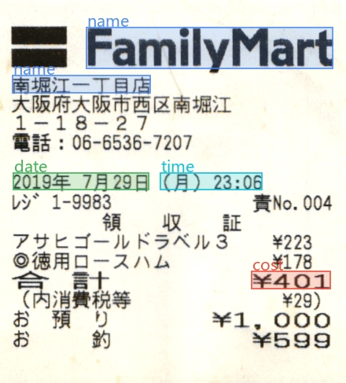

# Papertrail

> _Ex vestigiis veritas_  
> Truth from traces.



A personal document archival tool for digitizing receipts, tickets, and other timed documents into a structured timeline. Tested with over 3000 real documents in Japanese, Chinese and English.

This project is also built to test the "fast fashion era of SaaS from AI coding" idea and practice AI-assisted coding against a messy, real-world problem.

Design decisions are documented in [design_decisions.md](design_decisions.md).

# Setup

Install the virtual environment and dependencies:
```
python -m venv .venv
.venv\Scripts\activate
pip install -r requirements-deepseek.txt
```
Then follow the below guide to [install flash-attention on Windows](flash_attn.md).

---
If you don't want to use Deepseek OCR 2:
```
pip install -r requirements.txt
```
---
The web app also needs [Node.js](https://nodejs.org/) 22 or newer:
```
npm --prefix frontend install
```
---
The hosted extractors need an API key. Copy `.env.example` to `.env` and put yours in it; the file is
gitignored, and `env.py` says which one is read when you have several checkouts.

Run the API and the web app, each in its own terminal:
```
.venv\Scripts\python -m uvicorn api.main:app --host 127.0.0.1 --port 8000
npm --prefix frontend run dev
```
Then open http://127.0.0.1:5173. Both listen on this machine only.

To try things without touching your archive, `tools/sandbox_server.py` runs the API on a throwaway archive of
invented scans with fake models (port 8001); `npm --prefix frontend run dev:sandbox` serves the web app for it
on port 5174.

## Several checkouts at once

Each git worktree runs its own sandbox beside the main checkout's, on ports of its own. Set a new worktree up
once, with the main checkout's Python:
```
<main checkout>\.venv\Scripts\python tools\worktree_setup.py
npm --prefix frontend install
```
It claims the worktree a numbered slot — slot *n* serves its sandbox on API `8001+n` and web `5174+n` — and
prints the URL. The slot is kept for as long as the worktree exists, so the ports stay put across restarts;
deleting the worktree frees it. The main checkout's ports never change.

A worktree runs the **sandbox only**. The live archive belongs to the main checkout: two API processes on it,
running different code, is how it gets hurt, so `npm run dev` in a worktree refuses. A worktree that hasn't
been set up refuses to start its sandbox too, rather than landing on the main checkout's ports.

The setup also writes `.claude/launch.json`, the dev servers Claude Code starts. A worktree's are named for
its slot (`sandbox-api-1`, `sandbox-web-1`), so starting one never stands in for another checkout's server of
the same name. How slots are chosen is in `dev_ports.py`.

# Workflow
Scan your documents into a folder, and follow this process:

## Ingest
1. **File Index** — Ingest new batches of scanned files.
2. **OCR** — Batch OCR across all scanned images.
3. **Parse** — Parse OCR results into file metadata.
4. **Review** — Review parsed metadata and manually correct if needed. Mark bad documents for re-processing.
5. **Archive** — Organize files into date-based folders and clean up.

## Curate
1. **Marked Workshop** — Reprocess marked files with image enhancement, and contextual aids.
2. **Dedupe** — Time-based duplicate detection for documents with matching timestamps and costs.
3. **Normalize** — Unify similar merchant/document names.

## Visualize
1. **Dashboard** — Monthly spending timeline, document volume, top merchants.
2. **Merchant Profile** — Per-merchant stats, spending trend, receipt gallery, visit cadence.
3. **Receipt Detail** — Single-document view with metadata, line items, raw OCR, and in-place editing.
4. **Time Capsule** — "On this day" across past years.
5. **Calendar** — Week and month calendar view of archived documents by date.

## Dev
- **Experiment** — Interactive single-image OCR and extraction testing with image enhancement.
- **Sanity Check** — Validate batch coverage and archive metadata integrity.

## Config
- **Config** — Set input/output paths and toggle structured OCR.
